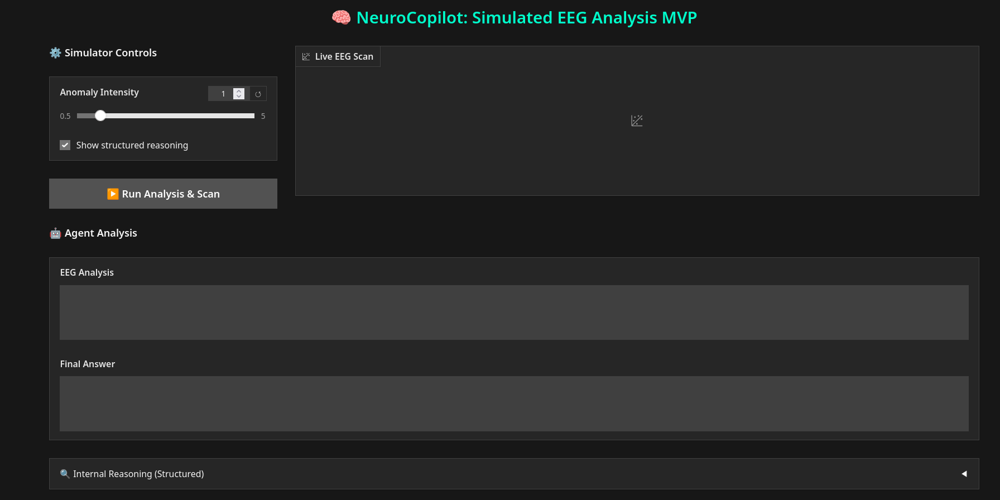
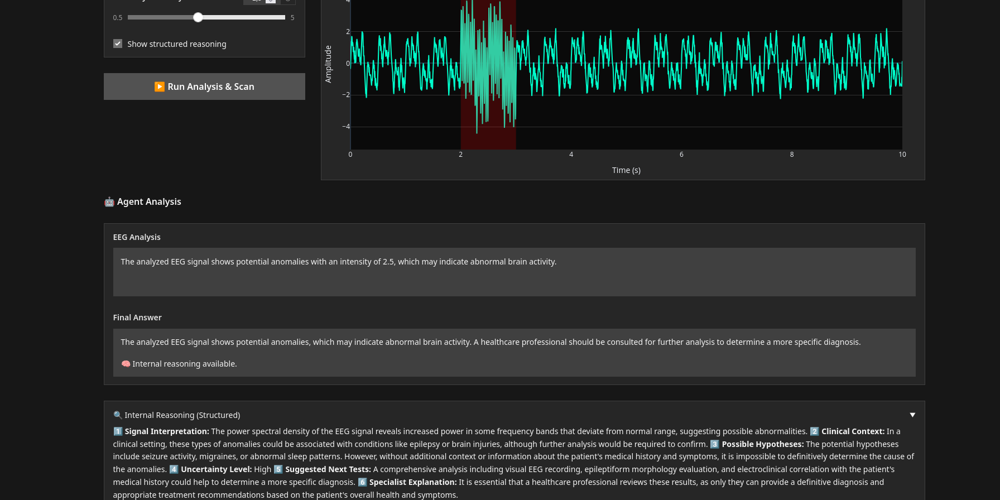
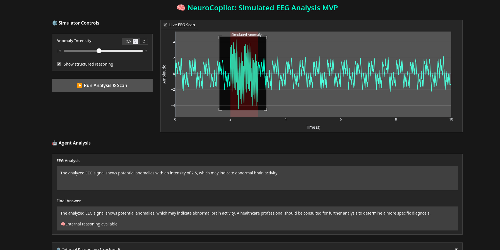
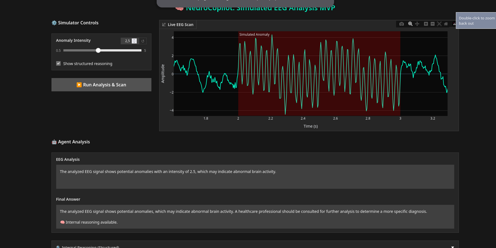

# 🧠 NeuroCopilot — AI Copilot for Simulated EEG Analysis

<p align="center">
  
</p>

NeuroCopilot is an **AI-assisted analysis system** designed to explore how Large Language Models can act as a **copilot for EEG signal interpretation** in a safe, simulated environment.

This project combines:

- 🧠 Simulated EEG signal generation
- 🤖 LLM-based structured reasoning
- ⚛️ Quantum-inspired feature mapping
- 📊 Interactive visualization interface
- 🔬 Educational and research-oriented analysis

> ⚠️ **Important:** This project uses **simulated data only** and does **NOT** provide medical diagnosis.

---

## ✨ Features

- Real-time simulated EEG signal visualization
- Automatic anomaly injection
- Structured AI reasoning pipeline
- Non-diagnostic hypothesis generation
- Expandable internal reasoning view
- Modular AI agent architecture
- Quantum-inspired feature transformation
- Testable and reproducible MVP

---

## 🧠 AI Stack

This project uses:
- Local LLMs running via Ollama
- LangChain / LangGraph for agent orchestration
- Python environment
  

## 🖥 Interface Preview

### Live EEG Scan
<p align="center">
  
</p>


<p align="center">
  
</p>

<p align="center">
  
</p>

---

## 🧩 System Architecture


Simulated EEG
↓
Feature Extraction
↓
Quantum Feature Mapping
↓
Anomaly Detection
↓
NeuroCopilot Agent (LLM)
↓
Structured Reasoning Output
↓
Gradio Interface


---

## 🧠 Structured Reasoning Model

The AI agent produces structured analytical reasoning:

1. Signal Interpretation  
2. Clinical Context (Educational)  
3. Possible Hypotheses (NON-DIAGNOSTIC)  
4. Uncertainty Level  
5. Suggested Next Tests  
6. Specialist Explanation  

This enables transparency while maintaining safe AI usage.

---

## ⚛️ Quantum-Inspired Component

The project includes a **quantum-inspired feature map**:

```python
def quantum_feature_map(features):
    q1 = cos(x)
    q2 = sin(y)
    q3 = cos(z)
    q4 = sin(x * y)
```

This simulates nonlinear transformations inspired by quantum state embeddings, helping explore hybrid AI + quantum paradigms without requiring quantum hardware.

## 📂 Project Structure
```
src/agent/
│
├── agents/          # AI agents
├── core/            # cognitive pipeline
├── processing/      # signal processing
├── simulation/      # EEG generator
├── visualization/   # plotting tools
├── interface/       # Gradio UI
└── prompts/         # reasoning prompts
```

## ⚙️ Installation

## 1️⃣ Clone repository

```
git clone https://github.com/Shel-y/Neurocopilot.git
cd Neurocopilot
```

## 2️⃣ Create virtual environment
```
python -m venv neurocopilot
source neurocopilot/bin/activate
```
## 3️⃣ Install dependencies
```
pip install -r requirements.txt
```

## ▶️ Run the Interface
```
python src/agent/interface/web_interface.py
```

or (recommended):
```
python web_interface_gradio.py
```
Then open:
```
http://127.0.0.1:7860
```

## 🧪 Running Tests

Quick local tests using Mock LLM:
```
python run_quick_tests.py
```
Full test suite:
```
pytest
```

## 🚀 Future Work

- Multi-channel EEG simulation

- Real-time streaming signals

- Explainability metrics

- AWS / Cloud deployment

- Quantum ML experimentation

- Specialist feedback interface

## 👩‍💻 Author

Joselyn Lagunas (Shel)
Software Engineer · AI & Interactive Systems

AWS Community Speaker
Innovation Developer

## 📜 License

MIT License

